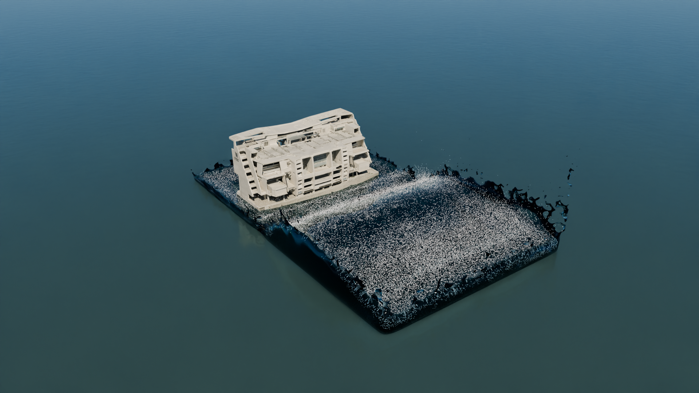
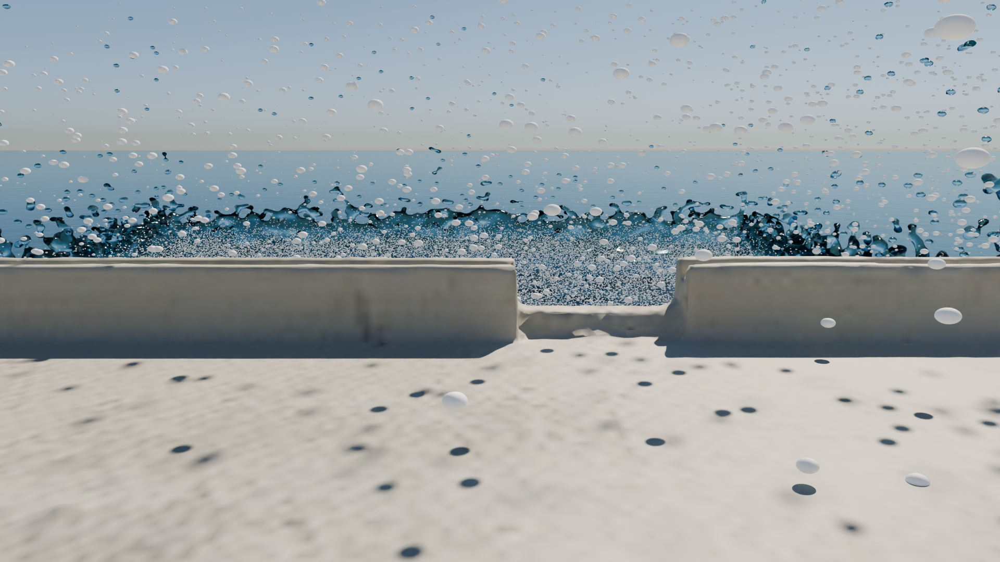

# Tsunami SPH sobre el campus UTEC

Simulación WCSPH en CUDA, colisión contra un edificio mediante SDF, reconstrucción
de superficie con SplashSurf y render cinematográfico con Blender Cycles.





## Resultado técnico

| Parámetro | Configuración final |
|---|---:|
| Dominio | 60 x 30 x 30 m |
| Partículas solicitadas | 4,500,000 |
| Partículas activas | 3,922,371 |
| Paso físico | 0.001 s |
| Pasos por frame | 8 |
| Frecuencia del cache | 125 Hz |
| Frames | 1,450 |
| Tiempo físico | 11.6 s |
| Video a 60 fps | 24.17 s |
| SDF | 75 x 75 x 106 voxels, 0.25 m |
| Penetraciones profundas | 0 con phi < -0.3 m |

## Flujo

```text
SDF del campus
    |
    v
WCSPH CUDA + spatial hash + boundary SDF
    |
    v
cache_cine/frame_XXXXXX.bin
    |
    +--> bulk PLY --> SplashSurf --> OBJ
    |
    +--> foam PLY --> capa opcional, desactivada en el render final
                         |
                         v
                Blender Cycles / OptiX
                         |
                         v
                 PNG sequence --> MP4
```

## Fases

| Fase | Carpeta | Alcance |
|---|---|---|
| 1 | `fase1_sph_tsunami/` | Solver WCSPH, SDF, CUDA, SLURM y despliegue |
| 2 | `fase2_splashsurf/` | Separación de spray, superficie, escena y render |
| 3 | `fase3/` | Activos Blender y composición final |
| 4 | `fase4_sdf/` | Limpieza geométrica y volumen de distancia firmado |

Cada carpeta contiene su README operativo. Los fundamentos matemáticos aparecen en
`fase1_sph_tsunami/INFORME_TECNICO.md`. Las decisiones visuales y los incidentes del
pipeline aparecen en `fase2_splashsurf/LOGICA.md`. El estado final de producción
aparece en `CONTEXTO_FASE3.md`.

## Requisitos

- NVIDIA CUDA Toolkit 12.x
- CMake 3.24 o posterior
- Compilador C++17
- Python 3.11 con NumPy
- pysplashsurf 0.14.1
- Blender 5.1.2
- FFmpeg

## Ejecución en Khipu

Sube el código y el SDF:

```bash
bash fase1_sph_tsunami/scripts/deploy_khipu_cine.sh \
  usuario@khipu.utec.edu.pe
```

En Khipu:

```bash
cd ~/computer_graphics/fase1_sph_tsunami
bash scripts/compile_login.sh
sbatch scripts/khipu_job_cine_sim.slurm
```

Cuando el cache contenga 1,450 frames:

```bash
sbatch --qos=a-tesis \
  scripts/khipu_job_cine_splash_range.slurm continuous 0 724

sbatch --qos=a-pregrado \
  scripts/khipu_job_cine_splash_range.slurm continuous 725 1449

sbatch --qos=a-pregrado \
  scripts/khipu_job_cine_splash_range.slurm granular 300 800
```

Los detalles de reanudación, cuotas y render aparecen en
`fase2_splashsurf/EJECUCION.md`.

## Formato del cache

Cada archivo `.bin` contiene:

```text
uint32 particle_count
particle_count x float32[3] position_xyz
```

El tamaño por frame equivale a `4 + particle_count * 12` bytes.

## Activos externos

Git no incluye escenas `.blend`, modelos `.glb`, caches, PLY, OBJ ni renders. La
escena final `escena_utec_v4_cine.blend` pesa cerca de 218 MB. Publícala como
GitHub Release o mediante almacenamiento institucional y registra su SHA-256 en
`fase3/README.md`.
